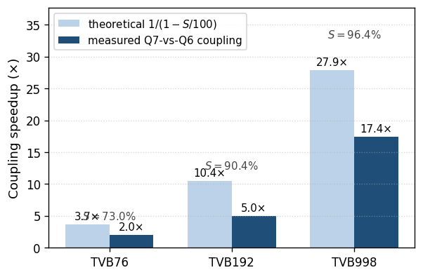
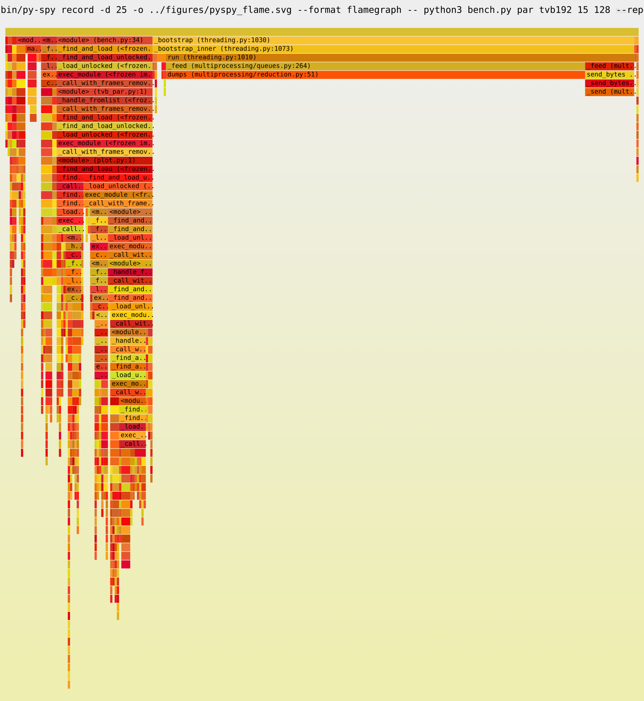
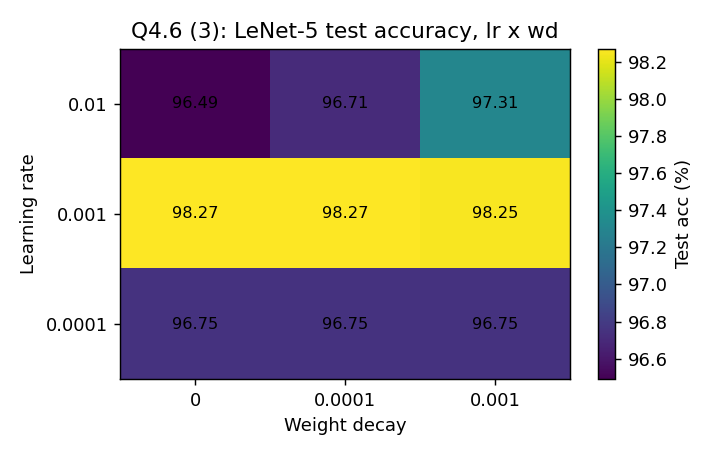
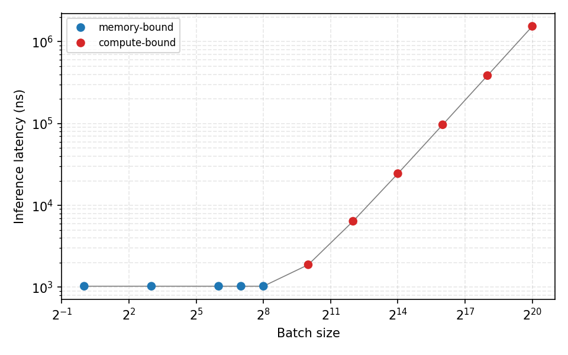

# CESE5040 High-Performance Computing and AI Architectures

Lab series for CESE5040 at TU Delft / Erasmus MC. The running theme is accelerating The Virtual Brain (TVB), a large-scale brain-network simulator, across six labs that climb the hardware stack from single-core Python to GPU, FPGA, and TPU, then pivot to training and profiling neural networks. Every lab has a submitted report, runnable scripts, captured results (`.jsonl`), and generated figures. Runs used a per-student AWS instance (see `AWS_WORKFLOW.md`).

`TVB_ALGORITHM.md` documents the simulator math and data layout that every lab builds on.

## Labs

### Lab 1: vectorization and JIT (CPU)
Profiled the baseline sequential TVB loop, exploited connectome sparsity (CSR coupling), vectorized with NumPy, and JIT-compiled with Numba. Scaling measured across the 76, 192, and 998-region connectomes.

### Lab 2: multi-core parallelism
Parallelized TVB with multiprocessing and shared-memory arrays, tuned the work-chunk size, and used py-spy sampling profiles (flame graph, top view) to find the remaining serial bottlenecks.

### Lab 3: GPU acceleration
Ported the vectorized simulator to the GPU with CuPy, profiled kernels with nvprof, and analyzed the compute/transfer breakdown and dataset-size scaling of throughput.

### Lab 4: neural-network training
Trained an MLP / LeNet-5 classifier and swept the training hyperparameters, batch size, learning rate, and weight decay, over multiple seeds.

### Lab 5: FPGA HLS and TPU
Synthesized an MLP inference kernel with Vivado HLS (reuse-factor and clock sweeps, power reports), and characterized a TPU inference roofline, tracing the transition from memory-bound to compute-bound as batch size grows.

### Lab 6: I/O optimization
Modeled and optimized the data-loading path (`io_model.py`, `io_fast.py`), profiling I/O against compute and measuring the scaling of the optimized pipeline.

## Lecture demos

`Lecture_*/` holds the profiling and acceleration demos worked through in lectures: five ways to time a Bessel kernel, cProfile/pstats, process pools (map, submit, chunksize, deadlock, IO vs compute), Game of Life and Mandelbrot vectorization, seam carving with JIT versus NumPy, and CuPy/Numba CUDA precision demos.

## Repository layout

| Path | Contents |
| --- | --- |
| `Lab_1/` to `Lab_6/` | Per-lab scripts, results, figures, report, and submission bundle |
| `Lecture_*/` | Lecture demo scripts |
| `report/template/` | Generic LaTeX report template; `new-lab.sh` seeds a new lab from it |
| `TVB_ALGORITHM.md` | TVB math and data-layout reference |
| `AWS_WORKFLOW.md`, `AWS_INSTANCE_SPECS.md` | Course AWS instance setup and specs |
| `SUBMISSION_GUIDELINES.md` | Report and code submission rules |

Tools: NumPy, Numba, multiprocessing, CuPy, Vivado HLS, TPU, py-spy / nvprof profiling, Python 3.12.
